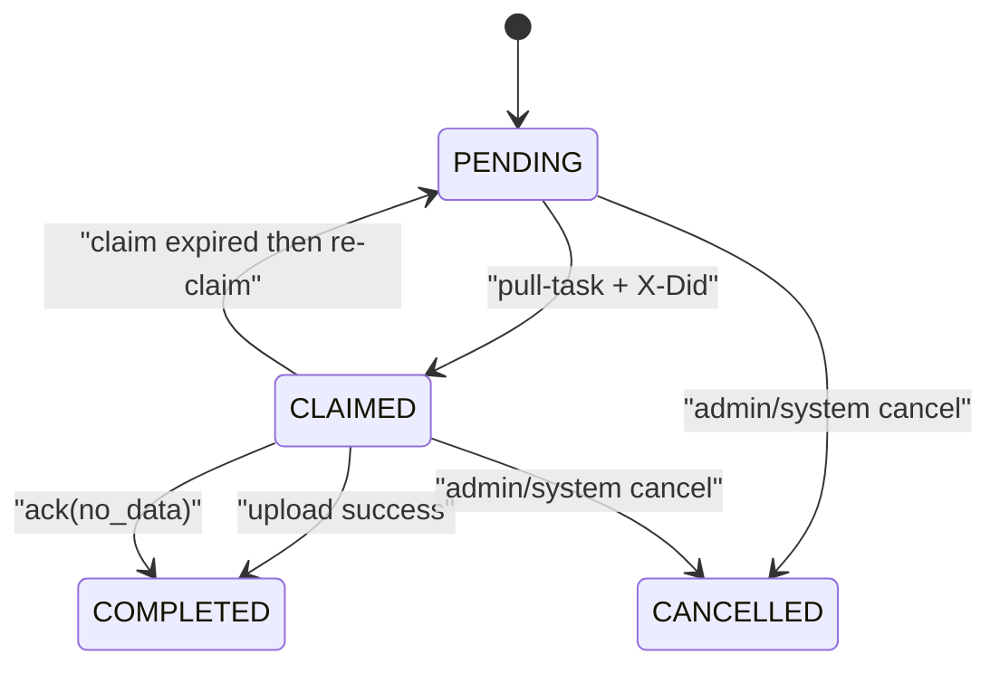
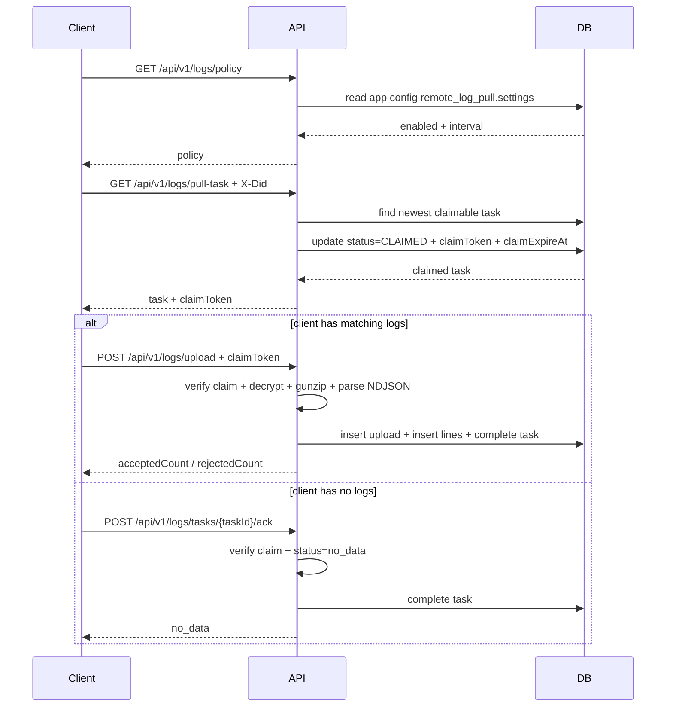

# Client Log Remote Pull Backend

这份文档描述 Zook 后端如何实现“客户端日志回捞”协议。目标是用最小成本解决 3 个问题：

- 后端可以按用户定向下发一段时间窗内的日志回捞任务
- 同一个 `did` 的多实例 / 多 tab 不会同时上传同一任务
- 客户端“有日志”和“没有日志”都能把任务闭环

## 1. 设计原则

- 不把日志策略耦合进通用 `app-config` 接口，对外单独提供 `GET /api/v1/logs/policy`
- 不引入重型 lease 状态机，只保留最小 `claimToken + claimExpireAt`
- 不要求“空 NDJSON 包上传”，客户端无数据时走独立 `ack(no_data)`
- 加密链路保持不变，继续使用 `AES-256-GCM + gzip + NDJSON`

## 2. 对外接口

### 2.1 `GET /api/v1/logs/policy`

返回当前 app 的日志回捞策略：

```json
{
  "enabled": false,
  "minPullIntervalSeconds": 1800
}
```

后端配置来源是 app 级配置键 `remote_log_pull.settings`。当前默认值：

- `enabled = false`
- `minPullIntervalSeconds = 1800`

### 2.2 `GET /api/v1/logs/pull-task`

请求头：

- `Authorization: Bearer ...`
- `X-App-Id`
- `X-Did`

成功且有任务时返回：

```json
{
  "shouldUpload": true,
  "taskId": "log_task_xxx",
  "claimToken": "log_claim_xxx",
  "claimExpireAtMs": 1770000000000,
  "fromTsMs": 1769990000000,
  "toTsMs": 1769993600000,
  "maxLines": 2000,
  "maxBytes": 1048576,
  "keyId": "logk_xxx"
}
```

没有任务时：

```json
{
  "shouldUpload": false
}
```

### 2.3 `POST /api/v1/logs/tasks/{taskId}/ack`

仅用于客户端确认“这一轮没有可上传日志”。

请求头：

- `Authorization: Bearer ...`
- `X-App-Id`
- `X-Did`

请求体：

```json
{
  "claimToken": "log_claim_xxx",
  "status": "no_data"
}
```

响应：

```json
{
  "taskId": "log_task_xxx",
  "status": "no_data"
}
```

### 2.4 `POST /api/v1/logs/upload`

请求头：

- `Authorization: Bearer ...`
- `X-App-Id`
- `X-Did`
- `X-Log-Task-Id`
- `X-Log-Claim-Token`
- `X-Log-Key-Id`
- `X-Log-Enc: aes-256-gcm`
- `X-Log-Nonce`
- `X-Log-Content: ndjson+gzip`
- `X-Log-Line-Count` 可选
- `X-Log-Plain-Bytes` 可选
- `X-Log-Compressed-Bytes` 可选

响应：

```json
{
  "taskId": "log_task_xxx",
  "acceptedCount": 12,
  "rejectedCount": 3
}
```

## 3. 任务状态

后端当前只保留 4 个状态：

- `PENDING`
- `CLAIMED`
- `COMPLETED`
- `CANCELLED`



## 4. Claim 规则

`claimToken` 是这套协议最重要的最小并发保护。

### 4.1 为什么要 claim

只靠 `did` 只能避免“不同设备重复上传”，不能避免：

- 同一浏览器两个 tab 同时拉任务
- 同一设备多个进程实例同时拉任务

所以服务端在 `pull-task` 成功返回时，会把任务从 `PENDING` 原子切到 `CLAIMED`，并写入：

- `did`
- `claimToken`
- `claimExpireAt`

### 4.2 当前 claim 语义

- 一个未过期的 `CLAIMED` 任务不会再次返回给任何实例
- claim 过期后，任务可以被同一个 `did` 重新领取
- `upload` 和 `ack(no_data)` 都必须同时校验：
  - `taskId`
  - `appId`
  - `userId`
  - `did`
  - `claimToken`
  - `claimExpireAt` 未过期

当前后端默认 claim TTL 是 5 分钟。

## 5. 一次完整流程



## 6. 存储结构

### 6.1 `zook_client_log_upload_tasks`

关键字段：

- `id`
- `app_id`
- `user_id`
- `did`
- `key_id`
- `from_ts_ms`
- `to_ts_ms`
- `max_lines`
- `max_bytes`
- `status`
- `claim_token`
- `claim_expire_at`
- `expires_at`
- `uploaded_at`

### 6.2 `zook_client_log_uploads`

保存一次成功上传的摘要：

- 加密方式
- nonce
- 原始/压缩/加密字节数
- 服务端接受/拒绝行数

### 6.3 `zook_client_log_lines`

保存被服务端接受的日志行，方便后续排障。

## 7. 错误码约定

- `LOG_TASK_MISMATCH`
  任务不存在、app/user 不匹配、任务已过期或已取消
- `LOG_CLAIM_MISMATCH`
  `did` / `claimToken` / 状态不匹配
- `LOG_CLAIM_EXPIRED`
  claim 已过期，客户端应重新 `pull-task`
- `LOG_TASK_ALREADY_COMPLETED`
  任务已完成，客户端应停止本轮上传/ack
- `LOG_DECRYPT_FAILED`
  解密失败
- `LOG_DECOMPRESS_FAILED`
  gunzip 失败
- `LOG_INVALID_NDJSON`
  NDJSON 非法

## 8. 配置来源

`remote_log_pull.settings` 是一个 app 级配置键，当前读取格式：

```json
{
  "enabled": true,
  "minPullIntervalSeconds": 300
}
```

如果配置缺失或配置非法，后端回退到默认值，不会让接口报错。

## 10. Admin 工作区

admin 前端会在每个 app 下单独提供 `Remote Log Pull` 工作区，而不是继续把这块塞进通用 `config`。

- `Settings`
  - 维护通用默认值
  - 支持 revision / restore
- `Task List`
  - 列出当前 app 的日志回捞任务
- `Create Task`
  - 只要求填写 `userId` 和 `did`
  - 时间窗口、行数上限、字节上限、`keyId` 都自动取自当前 app 设置和密钥

## 9. 当前实现范围

这版是 Phase 1 的轻量实现，刻意没有引入：

- trigger token
- admin 侧独立日志任务管理 UI
- 多版本 key ring
- 大规模 outbox / MQ 编排

先把协议跑通、状态闭环和并发领取补稳，后面再在这个基础上扩展。
