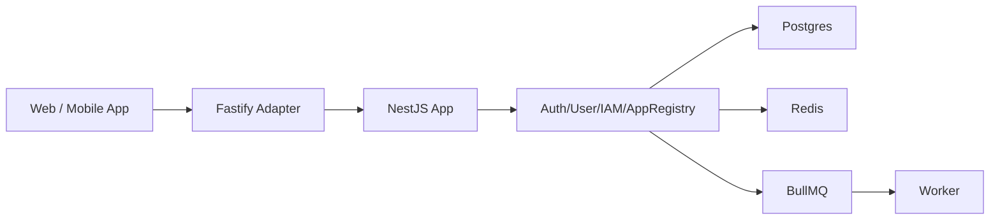

# 一个小中型 app 的服务端应该怎么设计？

> Version: v3.2 (MVP-Only)
>
> Last Updated: 2026-03-04
>
> Scope: 架构与实施规范文档（不含业务代码）
>
> Core Stack: NestJS + Fastify + Postgres + Redis + BullMQ + Prisma

## 0. 本版说明

本版只保留“当前就要实施”的 MVP 方案，不包含增强阶段内容。

## 1. 一句话结论

采用 `NestJS + Fastify + Modular Monolith`，固定为“共享账号 + appId 分域 + Bearer 单轨认证”。

1. A app / B app 用 `app_id` 区分。
2. 账号全局唯一，授权按 `app_id` 生效。
3. 异步用 BullMQ 直投 + `failed_events` 补偿。

## 2. 设计边界（避免概念误用）

1. `appId` 是应用作用域键，不是客户主体 ID。
2. 授权必须同时看 `user + app_id + action + resource`。
3. 数据访问不能只靠 `app_id`，还要校验资源归属字段。
4. 账号策略固定共享，不提供 per-app 独立账号模式。

## 3. MVP 范围（本次只做这些）

1. 认证：Bearer 单轨（Web 与 App 共用一套后端逻辑）。
2. 异步：BullMQ 直投，失败写 `failed_events` 并定时重投。
3. 凭证：仅密码登录，`password_hash` 存在 `users` 表。
4. 审计：`AuditInterceptor + audit_logs`。
5. 通知：`notification.service`。
6. 配置：`app-config.service + app_configs`。

## 4. MVP 架构总览



## 5. MVP 目录结构（精简版）

```text
.
├── docs/
│   └── small-medium-app-backend-design-discussion.md
├── src/
│   ├── main.ts
│   ├── worker.ts
│   ├── app.module.ts
│   ├── core/
│   │   ├── context/app-context.resolver.ts
│   │   ├── guards/
│   │   │   ├── auth.guard.ts
│   │   │   ├── app-access.guard.ts
│   │   │   └── rbac.guard.ts
│   │   ├── interceptors/audit.interceptor.ts
│   │   ├── filters/http-exception.filter.ts
│   │   └── pipes/validation.pipe.ts
│   ├── modules/
│   │   ├── auth/
│   │   ├── user/
│   │   ├── iam/
│   │   └── app-registry/
│   ├── services/
│   │   ├── app-config.service.ts
│   │   └── notification.service.ts
│   ├── infrastructure/
│   │   ├── database/prisma/
│   │   ├── cache/redis/
│   │   ├── queue/bullmq/
│   │   └── files/storage.service.ts
│   └── integrations/
│       ├── email/
│       ├── sms/
│       └── object-storage/
└── test/
    ├── unit/
    ├── integration/
    └── e2e/
```

说明：

1. `main.ts` 启动 API。
2. `worker.ts` 启动 BullMQ worker。
3. API 与 Worker 共用同一代码库，不同入口独立部署。

## 6. 共享账号策略（固定）

1. 账号全局唯一：`users.email` / `users.phone` 全局唯一。
2. app 成员关系：`app_users(app_id, user_id)`。
3. app 权限关系：`user_roles(app_id, user_id, role_id)`。
4. 同一用户可在不同 app 拥有不同角色。

### 6.1 首登策略（已定）

1. `join_mode = AUTO`：首登自动创建 `app_users`，默认角色 `member`。
2. `join_mode = INVITE_ONLY`：必须已在 `app_users` 中，否则 403。
3. 默认角色来自 `app_configs.auth.default_role_code`，默认 `member`。

### 6.2 状态优先级（已定）

1. `users.status = BLOCKED`：所有 app 禁止登录。
2. `users.status = ACTIVE` 且 `app_users.status = BLOCKED`：仅当前 app 禁止。
3. 两者均 ACTIVE：允许登录。

## 7. 认证策略（Bearer Only）

### 7.1 统一认证模型

1. Web 与 App 都使用 `access_token + refresh_token`。
2. Access Token：15 分钟。
3. Refresh Token：30 天，轮换（rotation）+ 撤销（revoke）。
4. Refresh Token 仅哈希存储。

### 7.2 凭证存放约定

1. Web：Access Token 放内存，Refresh Token 放 HttpOnly Cookie。
2. App：Access/Refresh 均由客户端安全存储。
3. 刷新与登出接口的 refresh token 解析顺序：优先 Cookie，其次请求体字段。

### 7.3 Guard 规则

1. 仅支持 Bearer 鉴权。
2. 缺少或无效 Bearer：401。
3. 请求 appId 与 token.app_id 不一致：403。

### 7.4 密码安全基线

1. 哈希算法：`argon2id`。
2. 密码最小要求：长度 >= 10，且包含字母与数字。
3. 登录失败达到 10 次 / 15 分钟：临时冻结 15 分钟。

### 7.5 Access Token 即时撤销 Trade-off

1. Access Token 默认 15 分钟有效期，不做实时黑名单。
2. 用户登出、封禁后，已签发 Access Token 在到期前可能仍短暂有效（最长约 15 分钟）。
3. 对“必须即时撤销”的业务场景，再引入 Redis `jti` 黑名单校验。

## 8. appId 解析与防伪造

### 8.1 appId 来源

1. 域名映射（优先）。
2. 可信网关 `X-App-Id`。
3. 登录前请求体/参数中的 `appId`（仅识别用途）。

### 8.2 真值规则

1. 登录后以 token 中 `app_id` 为真值。
2. 外部请求中的 `X-App-Id` 默认忽略或覆盖。
3. app 作用域查询必须带 `app_id` 过滤。

## 9. IAM 作用域与权限规则

1. `roles`：app 作用域（含 `app_id`）。
2. `permissions`：全局表（不带 `app_id`），避免多 app 重复 seed。
3. `role_permissions`：通过 role 关联到 app。
4. 权限码格式：`<domain>:<action>`，例如 `order:create`。
5. 禁止裸码：`create/read/update/delete`。

## 10. 数据模型（MVP 执行版）

1. `apps(id, code, name, status, api_domain, join_mode, created_at)`。
2. `users(id, email, phone, password_hash, password_algo, status, created_at)`。
3. `app_users(id, app_id, user_id, status, joined_at)`。
4. `roles(id, app_id, code, name, status)`。
5. `permissions(id, code, name, status)`。
6. `role_permissions(id, role_id, permission_id)`。
7. `user_roles(id, app_id, user_id, role_id)`。
8. `refresh_tokens(id, app_id, user_id, token_hash, expires_at, revoked_at, replaced_by)`。
9. `audit_logs(id, app_id, actor_user_id, action, resource_type, resource_id, resource_owner_user_id, payload, created_at)`。
10. `notification_jobs(id, app_id, recipient_user_id, channel, payload, status, retry_count)`。
11. `files(id, app_id, owner_user_id, storage_key, mime_type, size_bytes, status, created_at)`。
12. `failed_events(id, app_id, event_type, payload, error_message, retry_count, next_retry_at, created_at)`。
13. `app_configs(id, app_id, config_key, config_value, updated_at)`。

### 10.1 必要索引

1. `users(email)`、`users(phone)` 唯一。
2. `app_users(app_id, user_id)` 唯一。
3. `roles(app_id, code)` 唯一。
4. `permissions(code)` 唯一。
5. `user_roles(app_id, user_id, role_id)` 唯一。
6. `refresh_tokens(app_id, token_hash)` 唯一。

## 11. 异步机制（BullMQ 直投）

### 11.1 执行规则

1. 业务事务提交成功后直接 `queue.add(job)`。
2. 若 enqueue 失败，写入 `failed_events`。
3. 定时任务每 60 秒扫描 `failed_events` 重投。
4. 重投成功后删除 `failed_events` 记录（不做归档状态流转）。

### 11.2 Worker 规则

1. `attempts = 5`。
2. 指数退避重试。
3. 最终失败进入 DLQ。
4. DLQ 聚合告警（5 分钟一次）。

## 12. 核心 API 定义（必须可实现）

### 12.1 登录

`POST /api/v1/auth/login`

请求：

```json
{
  "appId": "app_a",
  "account": "alice@example.com",
  "password": "******"
}
```

响应（Web）：

```json
{
  "code": "OK",
  "message": "success",
  "data": {
    "accessToken": "...",
    "expiresIn": 900
  },
  "requestId": "req_123"
}
```

说明（Web）：

1. Refresh Token 通过 `Set-Cookie` 下发（HttpOnly）。
2. 响应体不返回 refreshToken 明文。

响应（App）：

```json
{
  "code": "OK",
  "message": "success",
  "data": {
    "accessToken": "...",
    "expiresIn": 900,
    "refreshToken": "..."
  },
  "requestId": "req_123"
}
```

### 12.2 刷新

`POST /api/v1/auth/refresh`

请求（Web）：

```json
{}
```

说明（Web）：

1. 浏览器自动附带 HttpOnly Cookie 中的 refresh token。
2. 后端优先从 Cookie 读取 refresh token。

请求（App）：

```json
{
  "appId": "app_a",
  "refreshToken": "..."
}
```

说明（App）：

1. 后端在无 Cookie 时从请求体读取 `refreshToken`。

响应（Web）：

```json
{
  "code": "OK",
  "message": "success",
  "data": {
    "accessToken": "...",
    "expiresIn": 900
  },
  "requestId": "req_123"
}
```

说明（Web）：

1. 新 refresh token 通过 `Set-Cookie` 回写。
2. 响应体不返回 refreshToken 明文。

响应（App）：

```json
{
  "code": "OK",
  "message": "success",
  "data": {
    "accessToken": "...",
    "expiresIn": 900,
    "refreshToken": "..."
  },
  "requestId": "req_123"
}
```

### 12.3 登出

`POST /api/v1/auth/logout`

请求（默认：当前设备登出）：

```json
{
  "appId": "app_a",
  "scope": "current"
}
```

说明：

1. 默认 `scope=current`：仅撤销当前 refresh token（Cookie 或 body 中提供的 token）。
2. 当 `scope=all`：撤销该用户在当前 app 下的所有 refresh token。
3. App 端若无 Cookie，`scope=current` 时必须在 body 提供 `refreshToken`。

请求（全设备登出）：

```json
{
  "appId": "app_a",
  "scope": "all"
}
```

## 13. 文件上传流程

### 13.1 预签名

`POST /api/v1/files/presign`

请求：

```json
{
  "appId": "app_a",
  "fileName": "avatar.png",
  "mimeType": "image/png",
  "sizeBytes": 102400
}
```

响应：返回 `uploadUrl`, `storageKey`, `expireAt`。

### 13.2 上传确认

`POST /api/v1/files/confirm`

请求：

```json
{
  "appId": "app_a",
  "storageKey": "files/app_a/2026/03/..",
  "mimeType": "image/png",
  "sizeBytes": 102400
}
```

规则：

1. 确认接口写入 `files` 表。
2. 下载时根据 `app_id + owner_user_id + 权限` 校验访问。
3. 成功后返回短时效下载签名 URL。

### 13.3 `files.status` 状态定义

1. `PENDING`：已生成预签名 URL，等待上传确认。
2. `CONFIRMED`：上传已确认，可参与下载授权。
3. `EXPIRED`：预签名过期且未确认。

## 14. Config 策略

1. `.env`：基础设施与密钥。
2. `app_configs`：运行时业务配置。
3. 缓存：Redis TTL 30 秒。
4. 写配置后删除缓存键，不做配置订阅总线。

## 15. Migration 与 Seed

### 15.1 Migration

1. 本地：`prisma migrate dev`。
2. 生产：`prisma migrate deploy`（仅 CI 可执行）。
3. 结构变更采用 Expand-Contract。

### 15.2 Seed

1. 初始化 apps、roles、permissions。
2. 初始化首个管理员账号。
3. 按环境区分 seed 参数。

## 16. 部署与运行

### 16.1 拓扑

1. API：2-4 实例。
2. Worker：独立 deployment（同仓库 `worker.ts` 启动）。
3. Postgres：托管主备。
4. Redis：单主 + 持久化。

### 16.2 CI/CD

`lint -> test -> build -> migrate deploy -> deploy(api+worker) -> health check`

### 16.3 备份

1. 每日全量 + 每小时增量。
2. 每月恢复演练。

## 17. 错误码体系

### 17.1 命名

`<DOMAIN>_<SCENARIO>`，例如：

1. `AUTH_INVALID_CREDENTIAL`
2. `AUTH_REFRESH_TOKEN_REVOKED`
3. `AUTH_APP_SCOPE_MISMATCH`
4. `IAM_PERMISSION_DENIED`
5. `APP_JOIN_INVITE_REQUIRED`
6. `REQ_IDEMPOTENCY_CONFLICT`
7. `FILE_ACCESS_DENIED`
8. `SYS_INTERNAL_ERROR`

### 17.2 映射

1. 401：认证失败。
2. 403：作用域不匹配或权限不足。
3. 409：幂等冲突。
4. 500：内部错误。

## 18. 测试矩阵

### 18.1 Unit

1. auth use-case。
2. rbac policy。
3. app-access guard。

### 18.2 Integration

1. Prisma repository。
2. queue producer/worker。
3. failed_events 重投任务。

### 18.3 E2E

1. 登录/刷新/登出链路。
2. `join_mode=INVITE_ONLY` 拒绝自动入组。
3. `users.status` 与 `app_users.status` 优先级。
4. app 作用域越权访问拦截。
5. 文件上传 presign -> upload -> confirm -> download。

## 19. ADR 快照

### ADR-0001（Accepted）

服务端框架采用 NestJS + Fastify。

### ADR-0002（Accepted）

作用域采用 `app_id`，并要求资源归属校验。

### ADR-0003（Accepted）

账号策略固定为共享账号（全局唯一 + app 内授权）。

### ADR-0004（Accepted）

异步机制采用 BullMQ 直投 + `failed_events` 补偿。

## 20. Decision Backlog

| ID | 项目 | 默认建议 | Owner | Due Date | Status |
|---|---|---|---|---|---|
| D-001 | Access Token TTL | 15 分钟 | Backend Lead | 2026-03-10 | Open |
| D-002 | Refresh Token TTL | 30 天 | Backend Lead | 2026-03-10 | Open |
| D-003 | Cookie SameSite | Lax | Security Owner | 2026-03-10 | Open |
| D-004 | Join Mode 默认值 | AUTO | Product + Backend | 2026-03-12 | Open |
| D-005 | 文件上传上限 | 20MB | Product + Backend | 2026-03-12 | Open |

## 21. Definition of Done

1. MVP 范围内的架构决策完整且可实现。
2. 核心 API（login/refresh/logout/files）有明确输入输出。
3. 认证、异步、迁移、部署策略都可直接执行。
4. 文档可直接指导当前阶段实现。
