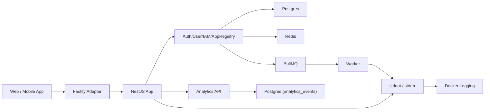

# 一个小中型 app 的服务端应该怎么设计？

> Version: v3.5 (MVP-Only)
>
> Last Updated: 2026-03-06
>
> Scope: 架构与实施规范文档（不含业务代码）
>
> Core Stack: NestJS + Fastify + Postgres + Redis + BullMQ + Prisma

## 0. 本版说明

本版只保留“当前就要实施”的 MVP 方案，不包含增强阶段内容。
补充产品统计与服务器日志基线方案。
统一工程约定为 TypeScript 优先开发。

### 0.1 开发语言约定

1. 后续业务开发默认使用 TypeScript。
2. 新增应用代码、模块、DTO、配置对象与基础设施适配层，均优先使用 `.ts`。
3. 当前仓库若存在少量 `.js` 启动骨架或历史文件，可暂时保留，但在相关模块发生实质性变更时，应优先迁移为 `.ts`。
4. 本机可使用全局 `tsc` / `tsx` 提升开发效率，但项目本身仍应在依赖中固定 TypeScript 版本，保证团队与 CI 一致性。

## 1. 一句话结论

采用 `NestJS + Fastify + Modular Monolith`，固定为“共享账号 + appId 分域 + Bearer 单轨认证”。

1. A app / B app 用 `app_id` 区分。
2. 账号全局唯一，授权按 `app_id` 生效。
3. 异步用 BullMQ 直投 + `failed_events` 补偿。

## 2. 设计边界（避免概念误用）

1. `appId` 是应用作用域键，不是客户主体 ID。
2. 授权必须同时看 `user + app_id + action + resource`。
3. 数据访问不能只靠 `app_id`，还要校验资源归属字段。
4. 账号策略固定共享，不提供 per-app 独立账号模式。

## 3. MVP 范围（本次只做这些）

1. 认证：Bearer 单轨（Web 与 App 共用一套后端逻辑）。
2. 异步：BullMQ 直投，失败写 `failed_events` 并定时重投。
3. 凭证：仅密码登录，`password_hash` 存在 `users` 表。
4. 审计：`AuditInterceptor + audit_logs`。
5. 产品统计：`analytics_events + metrics API`（DAU / 新用户注册数 / 页面停留时长）。
6. 通知：`notification.service`。
7. 配置：`app-config.service + app_configs`。
8. 运行日志：API + Worker 结构化日志与查看方式。

## 4. MVP 架构总览



## 5. MVP 目录结构（精简版）

```text
.
├── docs/
│   └── small-medium-app-backend-design-discussion.md
├── src/
│   ├── main.ts
│   ├── worker.ts
│   ├── app.module.ts
│   ├── core/
│   │   ├── context/app-context.resolver.ts
│   │   ├── guards/
│   │   │   ├── auth.guard.ts
│   │   │   ├── app-access.guard.ts
│   │   │   └── rbac.guard.ts
│   │   ├── interceptors/
│   │   │   ├── audit.interceptor.ts
│   │   │   └── request-logging.interceptor.ts
│   │   ├── filters/http-exception.filter.ts
│   │   └── pipes/validation.pipe.ts
│   ├── modules/
│   │   ├── auth/
│   │   ├── user/
│   │   ├── iam/
│   │   ├── app-registry/
│   │   └── analytics/
│   ├── services/
│   │   ├── app-config.service.ts
│   │   └── notification.service.ts
│   ├── infrastructure/
│   │   ├── database/prisma/
│   │   ├── cache/redis/
│   │   ├── queue/bullmq/
│   │   ├── files/storage.service.ts
│   │   └── logging/pino-logger.module.ts
│   └── integrations/
│       ├── email/
│       ├── sms/
│       └── object-storage/
└── test/
    ├── unit/
    ├── integration/
    └── e2e/
```

说明：

1. `main.ts` 启动 API。
2. `worker.ts` 启动 BullMQ worker。
3. API 与 Worker 共用同一代码库，不同入口独立部署。
4. `modules/analytics` 负责行为事件采集与指标查询。
5. `infrastructure/logging` 负责 `nestjs-pino` 集成与结构化日志输出。

## 6. 共享账号策略（固定）

1. 账号全局唯一：`users.email` / `users.phone` 全局唯一。
2. app 成员关系：`app_users(app_id, user_id)`。
3. app 权限关系：`user_roles(app_id, user_id, role_id)`。
4. 同一用户可在不同 app 拥有不同角色。

### 6.1 首登策略（已定）

1. `join_mode = AUTO`：首登自动创建 `app_users`，默认角色 `member`。
2. `join_mode = INVITE_ONLY`：必须已在 `app_users` 中，否则 403。
3. 默认角色来自 `app_configs.auth.default_role_code`，默认 `member`。

### 6.2 状态优先级（已定）

1. `users.status = BLOCKED`：所有 app 禁止登录。
2. `users.status = ACTIVE` 且 `app_users.status = BLOCKED`：仅当前 app 禁止。
3. 两者均 ACTIVE：允许登录。

## 7. 认证策略（Bearer Only）

### 7.1 统一认证模型

1. Web 与 App 都使用 `access_token + refresh_token`。
2. Access Token：15 分钟。
3. Refresh Token：30 天，轮换（rotation）+ 撤销（revoke）。
4. Refresh Token 仅哈希存储。

### 7.2 凭证存放约定

1. Web：Access Token 放内存，Refresh Token 放 HttpOnly Cookie。
2. App：Access/Refresh 均由客户端安全存储。
3. 刷新与登出接口的 refresh token 解析顺序：优先 Cookie，其次请求体字段。

### 7.3 Guard 规则

1. 仅支持 Bearer 鉴权。
2. 缺少或无效 Bearer：401。
3. 请求 appId 与 token.app_id 不一致：403。

### 7.4 密码安全基线

1. 哈希算法：`argon2id`。
2. 密码最小要求：长度 >= 10，且包含字母与数字。
3. 登录失败达到 10 次 / 15 分钟：临时冻结 15 分钟。

### 7.5 Access Token 即时撤销 Trade-off

1. Access Token 默认 15 分钟有效期，不做实时黑名单。
2. 用户登出、封禁后，已签发 Access Token 在到期前可能仍短暂有效（最长约 15 分钟）。
3. 对“必须即时撤销”的业务场景，再引入 Redis `jti` 黑名单校验。

## 8. appId 解析与防伪造

### 8.1 appId 来源

1. 域名映射（优先）。
2. 可信网关 `X-App-Id`。
3. 登录前请求体/参数中的 `appId`（仅识别用途）。
4. 单域名部署时，默认使用登录前请求体中的 `appId`；`X-App-Id` 仅作为可信代理透传或校验字段。

### 8.2 真值规则

1. 登录后以 token 中 `app_id` 为真值。
2. 外部请求中的 `X-App-Id` 默认忽略或覆盖。
3. app 作用域查询必须带 `app_id` 过滤。

### 8.3 单域名部署规则

1. 当所有 app 共用一个 API 域名时，不通过 URL 路径区分 app。
2. 登录前接口（如 `POST /api/v1/auth/login`）由请求体中的 `appId` 识别目标 app；若存在可信代理注入的 `X-App-Id`，仅用于校验或透传。
3. 登录成功后，服务端必须将 `app_id` 写入 access token 与 refresh token。
4. 登录后接口统一以 token 中的 `app_id` 为真值，不以请求体、查询参数或普通客户端自带 header 为真值。
5. 若请求中同时出现 `X-App-Id` 与 token `app_id`，且两者不一致，则返回 `403`。
6. 单域名 `MVP` 默认规则：登录前看 `body.appId`，登录后看 `token.app_id`，`X-App-Id` 为可选校验字段。

## 9. IAM 作用域与权限规则

1. `roles`：app 作用域（含 `app_id`）。
2. `permissions`：全局表（不带 `app_id`），避免多 app 重复 seed。
3. `role_permissions`：通过 role 关联到 app。
4. 权限码格式：`<domain>:<action>`，例如 `order:create`。
5. 禁止裸码：`create/read/update/delete`。

## 10. 数据模型（MVP 执行版）

1. `apps(id, code, name, status, api_domain, join_mode, created_at)`。
2. `users(id, email, phone, password_hash, password_algo, status, created_at)`。
3. `app_users(id, app_id, user_id, status, joined_at)`。
4. `roles(id, app_id, code, name, status)`。
5. `permissions(id, code, name, status)`。
6. `role_permissions(id, role_id, permission_id)`。
7. `user_roles(id, app_id, user_id, role_id)`。
8. `refresh_tokens(id, app_id, user_id, token_hash, expires_at, revoked_at, replaced_by)`。
9. `audit_logs(id, app_id, actor_user_id, action, resource_type, resource_id, resource_owner_user_id, payload, created_at)`。
10. `notification_jobs(id, app_id, recipient_user_id, channel, payload, status, retry_count)`。
11. `files(id, app_id, owner_user_id, storage_key, mime_type, size_bytes, status, created_at)`。
12. `failed_events(id, app_id, event_type, payload, error_message, retry_count, next_retry_at, created_at)`。
13. `app_configs(id, app_id, config_key, config_value, updated_at)`。
14. `analytics_events(id, app_id, user_id, platform, session_id, page_key, event_name, duration_ms, occurred_at, received_at, metadata)`。

### 10.1 必要索引

1. `users(email)`、`users(phone)` 唯一。
2. `app_users(app_id, user_id)` 唯一。
3. `roles(app_id, code)` 唯一。
4. `permissions(code)` 唯一。
5. `user_roles(app_id, user_id, role_id)` 唯一。
6. `refresh_tokens(app_id, token_hash)` 唯一。
7. `analytics_events(app_id, occurred_at)`。
8. `analytics_events(app_id, user_id, occurred_at)`。
9. `analytics_events(app_id, page_key, occurred_at)`。

### 10.2 统计口径与边界

1. `MVP` 统计默认按 `app` 维度，不提供全局账号口径作为主定义。
2. `DAU`：按 `app_id + 自然日`，从 `analytics_events` 去重 `user_id`。
3. `新用户注册数`：按 `app_id + 自然日`，以 `app_users.joined_at` 为真值；`MVP` 主口径定义为首次加入当前 app 的用户数。
4. 页面概念统一为 `page_key`；Web 路由与 App screen 均映射到该字段。
5. `页面停留时长`：按 `app_id + platform + page_key + 自然日` 聚合 `duration_ms`。
6. 事件模型固定包含 `page_view`、`page_leave`、`page_heartbeat`；默认心跳间隔 `15s`。
7. 默认时区使用 `Asia/Shanghai`。
8. `audit_logs` 仅用于审计，不用于产品统计。
9. `MVP` 仅统计已登录用户行为，不纳入匿名访客。

## 11. 异步机制（BullMQ 直投）

### 11.1 执行规则

1. 业务事务提交成功后直接 `queue.add(job)`。
2. 若 enqueue 失败，写入 `failed_events`。
3. 定时任务每 60 秒扫描 `failed_events` 重投。
4. 重投成功后删除 `failed_events` 记录（不做归档状态流转）。

### 11.2 Worker 规则

1. `attempts = 5`。
2. 指数退避重试。
3. 最终失败进入 DLQ。
4. DLQ 聚合告警（5 分钟一次）。

## 12. 核心 API 定义（必须可实现）

### 12.1 登录

`POST /api/v1/auth/login`

请求：

```json
{
  "appId": "app_a",
  "account": "alice@example.com",
  "password": "******"
}
```

响应（Web）：

```json
{
  "code": "OK",
  "message": "success",
  "data": {
    "accessToken": "...",
    "expiresIn": 900
  },
  "requestId": "req_123"
}
```

说明（Web）：

1. Refresh Token 通过 `Set-Cookie` 下发（HttpOnly）。
2. 响应体不返回 refreshToken 明文。

响应（App）：

```json
{
  "code": "OK",
  "message": "success",
  "data": {
    "accessToken": "...",
    "expiresIn": 900,
    "refreshToken": "..."
  },
  "requestId": "req_123"
}
```

### 12.2 刷新

`POST /api/v1/auth/refresh`

请求（Web）：

```json
{}
```

说明（Web）：

1. 浏览器自动附带 HttpOnly Cookie 中的 refresh token。
2. 后端优先从 Cookie 读取 refresh token。

请求（App）：

```json
{
  "appId": "app_a",
  "refreshToken": "..."
}
```

说明（App）：

1. 后端在无 Cookie 时从请求体读取 `refreshToken`。

响应（Web）：

```json
{
  "code": "OK",
  "message": "success",
  "data": {
    "accessToken": "...",
    "expiresIn": 900
  },
  "requestId": "req_123"
}
```

说明（Web）：

1. 新 refresh token 通过 `Set-Cookie` 回写。
2. 响应体不返回 refreshToken 明文。

响应（App）：

```json
{
  "code": "OK",
  "message": "success",
  "data": {
    "accessToken": "...",
    "expiresIn": 900,
    "refreshToken": "..."
  },
  "requestId": "req_123"
}
```

### 12.3 登出

`POST /api/v1/auth/logout`

请求（默认：当前设备登出）：

```json
{
  "appId": "app_a",
  "scope": "current"
}
```

说明：

1. 默认 `scope=current`：仅撤销当前 refresh token（Cookie 或 body 中提供的 token）。
2. 当 `scope=all`：撤销该用户在当前 app 下的所有 refresh token。
3. App 端若无 Cookie，`scope=current` 时必须在 body 提供 `refreshToken`。

请求（全设备登出）：

```json
{
  "appId": "app_a",
  "scope": "all"
}
```

### 12.4 产品统计

#### 12.4.1 事件上报

`POST /api/v1/analytics/events/batch`

请求：

```json
{
  "appId": "app_a",
  "events": [
    {
      "platform": "web",
      "sessionId": "sess_123",
      "pageKey": "/home",
      "eventName": "page_view",
      "occurredAt": "2026-03-06T10:00:00+08:00"
    }
  ]
}
```

说明：

1. `eventName` 固定支持 `page_view`、`page_leave`、`page_heartbeat`。
2. `durationMs` 仅在 `page_leave`、`page_heartbeat` 中使用。
3. `pageKey` 同时承载 Web 路由与 App screen 标识。
4. 客户端默认每 `15s` 上报一次 `page_heartbeat`。

响应：

```json
{
  "code": "OK",
  "message": "success",
  "data": {
    "accepted": 1
  },
  "requestId": "req_123"
}
```

#### 12.4.2 概览查询

`GET /api/v1/admin/metrics/overview`

查询参数：`appId`、`dateFrom`、`dateTo`。

响应轮廓：

```json
{
  "code": "OK",
  "message": "success",
  "data": {
    "timezone": "Asia/Shanghai",
    "items": [
      {
        "date": "2026-03-06",
        "dau": 1200,
        "newUsers": 80
      }
    ]
  },
  "requestId": "req_123"
}
```

#### 12.4.3 页面统计查询

`GET /api/v1/admin/metrics/pages`

查询参数：`appId`、`dateFrom`、`dateTo`、`platform`（可选）。

响应轮廓：

```json
{
  "code": "OK",
  "message": "success",
  "data": {
    "timezone": "Asia/Shanghai",
    "items": [
      {
        "pageKey": "/home",
        "platform": "web",
        "uv": 300,
        "sessionCount": 420,
        "totalDurationMs": 840000,
        "avgDurationMs": 2800
      }
    ]
  },
  "requestId": "req_123"
}
```

规则：

1. 统计查询必须基于当前 `appId`，不能跨 app 聚合。
2. 统计查询受既有 Bearer 鉴权与 `app_id` 作用域约束。
3. 报表时间边界默认按 `Asia/Shanghai` 解释。

## 13. 文件上传流程

### 13.1 预签名

`POST /api/v1/files/presign`

请求：

```json
{
  "appId": "app_a",
  "fileName": "avatar.png",
  "mimeType": "image/png",
  "sizeBytes": 102400
}
```

响应：返回 `uploadUrl`, `storageKey`, `expireAt`。

### 13.2 上传确认

`POST /api/v1/files/confirm`

请求：

```json
{
  "appId": "app_a",
  "storageKey": "files/app_a/2026/03/..",
  "mimeType": "image/png",
  "sizeBytes": 102400
}
```

规则：

1. 确认接口写入 `files` 表。
2. 下载时根据 `app_id + owner_user_id + 权限` 校验访问。
3. 成功后返回短时效下载签名 URL。

### 13.3 `files.status` 状态定义

1. `PENDING`：已生成预签名 URL，等待上传确认。
2. `CONFIRMED`：上传已确认，可参与下载授权。
3. `EXPIRED`：预签名过期且未确认。

## 14. Config 策略

1. `.env`：基础设施与密钥。
2. `app_configs`：运行时业务配置。
3. 缓存：Redis TTL 30 秒。
4. 写配置后删除缓存键，不做配置订阅总线。

## 15. Migration 与 Seed

### 15.1 Migration

1. 本地：`prisma migrate dev`。
2. 生产：默认由 CI 执行 `prisma migrate deploy`；紧急人工发布时允许在服务器受控执行同一命令。
3. 结构变更采用 Expand-Contract。

### 15.2 Seed

1. 初始化 apps、roles、permissions。
2. 初始化首个管理员账号。
3. 按环境区分 seed 参数。

## 16. 部署与运行

### 16.1 拓扑

1. `MVP` 默认部署目标为 1 台 Linux 小型服务器，使用 Docker/Compose 管理应用层服务。
2. 反向代理：Nginx 或 Caddy，负责 TLS、单域名入口与转发。
3. API：默认 1 个容器实例；资源允许时可扩为同机 2 实例。
4. Worker：同机独立容器，使用同仓库 `worker.ts` 启动。
5. 生产长期方案固定为“应用在 Compose，Postgres / Redis 分离”；Postgres 与 Redis 独立部署，优先使用托管服务。
6. 生产 `compose` 默认编排 `proxy`、`api`、`worker`；需要网页查看日志时可增加 `dozzle` 作为运维辅助容器，不在同一 `compose` 中承载 Postgres / Redis。
7. 应用通过 `.env` 中的连接串访问外部 Postgres / Redis。
8. 发布单位固定为 Git tag 或镜像 tag，不直接在生产机手改代码。

### 16.2 手动部署（默认兜底）

1. 适用场景：早期 MVP、低频发布、紧急修复。
2. 服务器长期保存：`.env`、`compose.yaml`、反向代理配置、`appRunData/`。
3. `appRunData/` 仅保存应用运行所需的动态数据，例如 `uploads/`、`backups/`、`proxy/`、`exports/`；不保存 Postgres / Redis 数据目录，不保存 API / Worker 原始运行日志文件。
4. 发布前先确认目标版本号，并记录当前稳定版本号用于回滚。
5. 若本次包含 migration，发布前必须先备份外部 Postgres。
6. 登录服务器后，拉取目标版本代码或目标镜像。
7. 更新容器：优先 `docker compose pull`；若采用服务器本地构建，则执行 `docker compose build`。
8. 在 API 容器上下文执行 `prisma migrate deploy`，该命令连接外部 Postgres。
9. 执行 `docker compose up -d api worker` 完成发布。
10. 发布后必须执行健康检查，并查看最近日志确认启动成功。
11. 回滚时优先切回上一个 Git tag 或镜像 tag，再重新执行 `docker compose up -d`；不在生产直接做破坏性 schema 回滚。

### 16.3 自动化部署（推荐）

1. 触发方式：合并到主分支后的 CI，或手动触发指定 tag 发布。
2. 推荐流水线：`lint -> test -> build image -> push image -> ssh server -> docker compose pull -> prisma migrate deploy -> docker compose up -d api worker -> health check`。
3. 自动化部署默认采用“构建镜像并推送镜像仓库”的方式，不推荐 CI 直接在生产机执行 `git pull` 作为长期方案。
4. 服务器只保留：`.env`、`compose.yaml`、反向代理配置、`appRunData/`；业务版本通过镜像 tag 切换。
5. CI 需要保管的敏感信息仅包括：镜像仓库凭证、服务器 SSH 凭证、必要的部署变量。
6. 外部 Postgres / Redis 的生命周期不与应用容器发布绑定；CI 不负责重建数据库或缓存实例。
7. 自动化回滚方式与手动一致：重新发布上一个稳定镜像 tag。
8. 若 health check 失败，流水线应停止并保留回滚入口，不继续覆盖后续服务。

### 16.4 备份

1. 外部 Postgres 执行每日全量 + 每小时增量备份。
2. 外部 Redis 使用托管备份能力，或开启持久化并按日导出快照。
3. 每月恢复演练。
4. 涉及 migration 的发布前必须额外执行一次外部 Postgres 即时备份。

### 16.5 日志与网页查看方式

1. Nest 日志方案固定采用 `nestjs-pino`。
2. API 与 Worker 统一输出结构化 JSON 日志到 `stdout/stderr`，不以业务应用直接写文件作为主方案。
3. API 日志最少包含：`timestamp`、`level`、`service`、`requestId`、`appId`、`userId`、`path`、`statusCode`、`latencyMs`。
4. Worker 日志在上述基础上额外包含：`jobName`、`jobId`。
5. `requestId` 必须贯穿请求链路；优先复用入口请求头中的 `X-Request-Id`，无值时由服务端生成。
6. 运行日志由 Docker logging driver 管理，默认启用日志轮转；建议 `max-size=100m`、`max-file=7`。
7. 不建议将应用运行日志写入容器内文件，也不建议在业务系统中自行开发日志前端页面作为 `MVP` 方案。
8. 网页查看日志默认采用 Dozzle；Dozzle 直接读取 Docker 容器日志，适合单机实时查看。
9. Dozzle 必须放在反向代理和鉴权之后，不直接裸暴露到公网。
10. `MVP` 的网页日志能力目标为实时 tail、按容器筛选、按关键字搜索、按时间查看；不将复杂日志检索系统纳入当前范围。
11. Dozzle 仅作为轻量查看层，不替代长期归档与专业日志平台。
12. 常用命令行查看命令：`docker compose logs -f api`。
13. 常用命令行查看命令：`docker compose logs -f worker`。
14. 常用命令行查看命令：`docker compose logs --since 1h api`。

## 17. 错误码体系

### 17.1 命名

`<DOMAIN>_<SCENARIO>`，例如：

1. `AUTH_INVALID_CREDENTIAL`
2. `AUTH_REFRESH_TOKEN_REVOKED`
3. `AUTH_APP_SCOPE_MISMATCH`
4. `IAM_PERMISSION_DENIED`
5. `APP_JOIN_INVITE_REQUIRED`
6. `REQ_IDEMPOTENCY_CONFLICT`
7. `FILE_ACCESS_DENIED`
8. `SYS_INTERNAL_ERROR`

### 17.2 映射

1. 401：认证失败。
2. 403：作用域不匹配或权限不足。
3. 409：幂等冲突。
4. 500：内部错误。

## 18. 测试矩阵

### 18.1 Unit

1. auth use-case。
2. rbac policy。
3. app-access guard。
4. analytics 指标口径（DAU 去重 / 新用户口径 / 页面时长聚合）。

### 18.2 Integration

1. Prisma repository。
2. queue producer/worker。
3. failed_events 重投任务。
4. analytics events 写入与聚合查询。
5. API / Worker `nestjs-pino` 结构化日志字段输出。
6. Docker/Compose 日志可查看。
7. Dozzle 可实时查看 API / Worker 日志。

### 18.3 E2E

1. 登录/刷新/登出链路。
2. `join_mode=INVITE_ONLY` 拒绝自动入组。
3. `users.status` 与 `app_users.status` 优先级。
4. app 作用域越权访问拦截。
5. 文件上传 presign -> upload -> confirm -> download。
6. analytics events 上报 -> overview/pages 查询。
7. analytics 跨 app 隔离。
8. 页面时长心跳补偿。
9. Dozzle 页面可查看 API / Worker 最新日志。

## 19. ADR 快照

### ADR-0001（Accepted）

服务端框架采用 NestJS + Fastify。

### ADR-0002（Accepted）

作用域采用 `app_id`，并要求资源归属校验。

### ADR-0003（Accepted）

账号策略固定为共享账号（全局唯一 + app 内授权）。

### ADR-0004（Accepted）

异步机制采用 BullMQ 直投 + `failed_events` 补偿。

### ADR-0005（Accepted）

产品统计采用独立 `analytics_events`，不复用 `audit_logs`。

### ADR-0006（Accepted）

运行日志采用 `nestjs-pino` 输出结构化 JSON 到 `stdout/stderr`，默认由 Docker 采集并通过 Dozzle 网页查看。

### ADR-0007（Accepted）

生产长期部署形态采用“应用在 Compose，Postgres / Redis 分离”。

## 20. Decision Backlog

| ID | 项目 | 默认建议 | Owner | Due Date | Status |
|---|---|---|---|---|---|
| D-001 | Access Token TTL | 15 分钟 | Backend Lead | 2026-03-10 | Open |
| D-002 | Refresh Token TTL | 30 天 | Backend Lead | 2026-03-10 | Open |
| D-003 | Cookie SameSite | Lax | Security Owner | 2026-03-10 | Open |
| D-004 | Join Mode 默认值 | AUTO | Product + Backend | 2026-03-12 | Open |
| D-005 | 文件上传上限 | 20MB | Product + Backend | 2026-03-12 | Open |

## 21. Definition of Done

1. MVP 范围内的架构决策完整且可实现。
2. 核心 API（login/refresh/logout/files/analytics）有明确输入输出。
3. 认证、异步、迁移、部署策略都可直接执行。
4. 读者可明确区分 `audit_logs`、`analytics_events`、运行日志三类数据边界。
5. 可按 app 查询 `DAU`、新用户注册数、页面停留时长。
6. 可通过 Docker/Compose 与 Dozzle 查看 API 与 Worker 日志。
7. 单机服务器的手动部署、自动化部署与回滚路径明确。
8. 生产长期部署形态已明确为“应用在 Compose，Postgres / Redis 分离”。
9. 文档可直接指导当前阶段实现。
